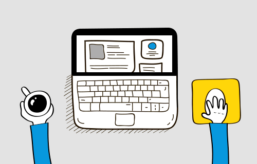

# 👋 Hi, I'm [Arif Maulana](https://github.com/arifcva)

---

## 🚀 About Me  

- 🎓 Informatics Student at [STIKOM UYELINDO KUPANG](https://siamiruyelindo.ac.id/)  
- 💻 Passionate **Frontend Developer**  
- 📚 Currently learning **Next.js** with **TypeScript**  
- 🤝 Open to collaborate & always happy to help  

---

## 🛠 Tech Stack  

**Languages & Frameworks**  

  

**Styling & Tools**  

  

---

## 📊 GitHub Stats  

  
  

---

## ✨ Fun Fact  
> “Code is like humor. When you have to explain it, it’s bad.” 😆  

